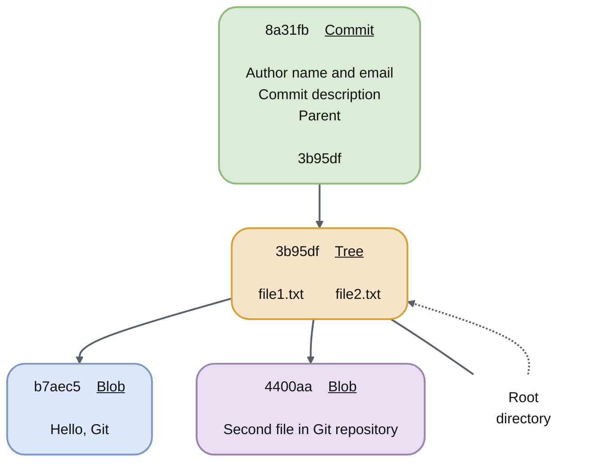

# Commit

Commit hast same structure as blob and tree. It containt object type, object length and content of the object.
Each git commit has has: author name and email, commit description and parent (is optional) and has own sha1 hash.
Commit contains pointer to specific tree.

Commit is an wrapper around tree object in git database.

